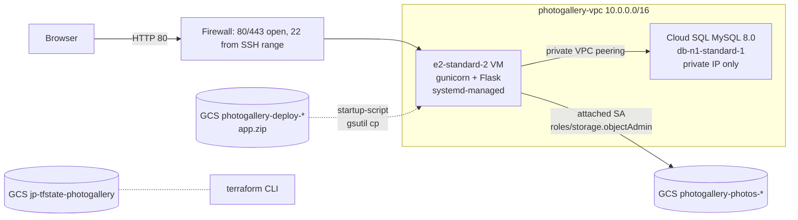

# Photogallery on GCP — Terraform

SE 4220 Final Project. Provisions the entire cloud stack for the
[`Chapter-6/photogallery`](..) Flask app on Google Cloud Platform with
Terraform: custom VPC, Compute Engine VM, private Cloud SQL MySQL, GCS
buckets, firewall rules, and a least-privilege service account.

## Architecture



## Files

| File | Purpose |
|------|---------|
| `requirements.tf` | Provider + Terraform version pins (named per assignment) |
| `backend.tf` | GCS remote state config |
| `variables.tf` | All inputs with `validation` blocks |
| `outputs.tf` | VM IP, app/health URLs, DB private IP, bucket names, SSH command |
| `main.tf` | All resources (network, SQL, GCS, IAM, VM) grouped into sections |
| `startup.sh` | VM cloud-init: installs deps, fetches app, runs schema, starts gunicorn via systemd |
| `schema.sql` | `users` + `photogallery` table DDL (idempotent) |
| `terraform.tfvars.example` | Template for the gitignored real `terraform.tfvars` |

## One-time bootstrap

Terraform can't create the bucket that holds its own state on the first run,
so set it up manually. **Run these once per GCP project**, not on every
apply.

```bash
# 1. Set your project and region
export PROJECT_ID=your-gcp-project-id
gcloud config set project "$PROJECT_ID"

# 2. Enable the APIs Terraform will call
gcloud services enable \
  compute.googleapis.com \
  sqladmin.googleapis.com \
  servicenetworking.googleapis.com \
  iam.googleapis.com \
  storage.googleapis.com \
  cloudresourcemanager.googleapis.com

# 3. Create the GCS bucket for Terraform remote state (versioned, single-region)
gcloud storage buckets create gs://jp-tfstate-photogallery \
  --location=us-central1 \
  --uniform-bucket-level-access
gcloud storage buckets update gs://jp-tfstate-photogallery --versioning

# 4. Authenticate Terraform
gcloud auth application-default login
```

If you pick a different bucket name, update `bucket = "..."` in
[`backend.tf`](backend.tf) (or pass it at init: `terraform init
-backend-config="bucket=<your-bucket>"`).

## First run

```bash
cd Chapter-6/photogallery/terraform
cp terraform.tfvars.example terraform.tfvars
# edit terraform.tfvars: set project_id, db_password (>=12 chars),
# flask_secret_key (>=16 chars), and ssh_source_ranges to your /32

terraform init
terraform plan -out tfplan
terraform apply tfplan
```

Apply takes about 8–12 minutes (Cloud SQL is the slow one). When it
finishes, the outputs print everything you need:

```bash
terraform output
# vm_public_ip      = "34.x.x.x"
# app_url           = "http://34.x.x.x/"
# health_url        = "http://34.x.x.x/health"
# db_private_ip     = "10.x.x.x"
# ...
```

The VM still needs ~2–3 minutes after `apply` returns for the startup
script to install packages and start gunicorn. Watch progress:

```bash
gcloud compute ssh photogallery-vm --zone=us-central1-a \
  --command="sudo tail -f /var/log/photogallery-startup.log"
```

Once you see `=== photogallery startup script done ===`:

```bash
curl "$(terraform output -raw health_url)"        # -> ok
open  "$(terraform output -raw app_url)"          # register a user, upload a photo
```

## Validating the deliverables

The assignment asks for screenshots of:

1. **`terraform apply` output** — capture the tail of the apply with the
   `Apply complete!` line and the outputs.
2. **GCP Console resources** — VPC Networks, Compute Engine, and Cloud SQL
   pages should each show one new resource.
3. **Working application** — the app URL with at least one uploaded photo
   visible.
4. **Database connection test** — from the VM:

   ```bash
   gcloud compute ssh photogallery-vm --zone=us-central1-a
   mysql -h <db_private_ip> -u photogallery -p photogallerydb \
     -e "SHOW TABLES; SELECT COUNT(*) FROM photogallery;"
   ```

The 5-minute video should walk through `terraform init → plan → apply →
register/upload in browser → terraform destroy`.

## Tear down

```bash
terraform destroy
```

Removes the VM, Cloud SQL instance, both buckets, the VPC, and the
service account. The state bucket created in bootstrap stays — delete it
manually with `gcloud storage rm -r gs://jp-tfstate-photogallery` if you
want to start completely fresh.

## How this differs from the App Engine deployment

| Concern | App Engine (current `main`) | Terraform/VM (this folder) |
|---------|-----------------------------|----------------------------|
| Compute | App Engine Standard, scale-to-zero | Always-on `e2-standard-2` VM |
| MySQL host | Manually-managed VM at `136.116.60.71` | Cloud SQL MySQL on private IP |
| GCS auth | `gcp-key.json` shipped with deploy | Application Default Credentials via attached SA |
| Process supervision | App Engine + gunicorn entrypoint in `app.yaml` | systemd unit installed by `startup.sh` |
| Schema bootstrap | Manual `mysql ... < schema.sql` | Run by `startup.sh` on first boot |
| Health check | `/_ah/warmup` (App Engine convention) | `/health` (still ships `/_ah/warmup` for backward compat) |

Both deployments coexist — `main.py` handles either by reading
`GCP_KEY_FILE` only if it actually exists on disk.
