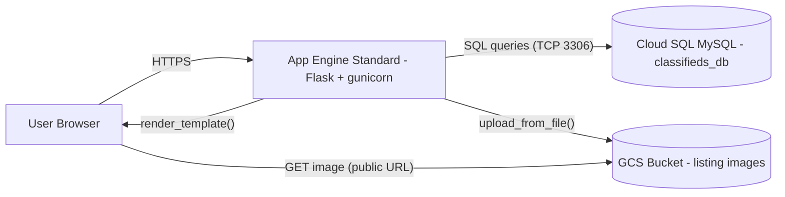
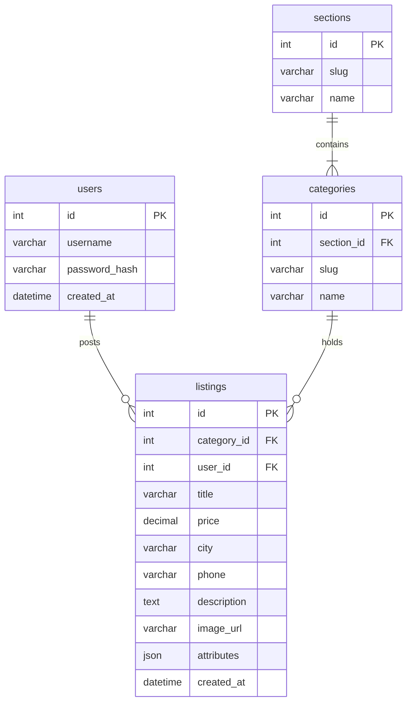
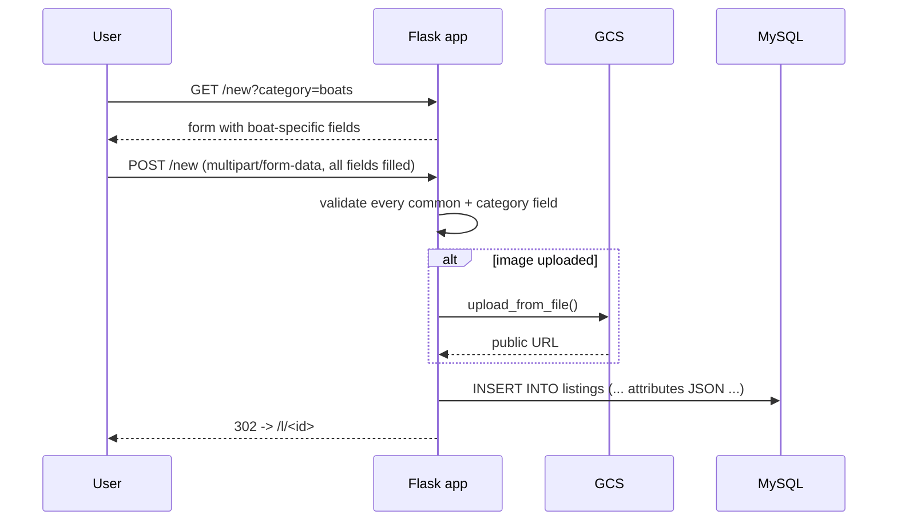

# Ames Classifieds — Architecture & Technical Report

This document describes the system architecture, technology choices, data
model, and key flows for the Ames classifieds demo built for SE 4220.

## 1. Overview

The application is a Craigslist-style classified ads website scoped to a
single city (Ames, Iowa). Visitors can browse all listings without an
account; registered users can publish new listings (with full server-side
validation that all fields are filled in). The entire stack runs on Google
Cloud Platform.


## 2. System Architecture Diagram



**Request lifecycle for a typical page view:**

1. Browser sends `GET /c/boats` over HTTPS to the App Engine front door.
2. App Engine routes to the Flask app process, which `SELECT`s matching
   listings from Cloud SQL.
3. Flask renders `category.html` and returns the HTML.
4. The browser fetches each listing image directly from GCS via its
   public URL — App Engine never proxies image bytes.

## 3. Component Inventory

| Component | Technology | Why this choice |
|-----------|------------|-----------------|
| Web framework | Flask 2.2 (Python 3.12) | Smallest possible step from "a Python script" to a web app. Same framework already used in `Chapter-6/photogallery`. |
| Templating | Jinja2 + Bootstrap 5 (CDN) | Server-rendered HTML; no JS framework needed for a CRUD demo. |
| WSGI server | gunicorn | Production-grade WSGI server expected by App Engine Standard. |
| Hosting | GCP App Engine Standard (Python 3.12) | Zero-ops hosting with free-tier scale-to-zero. `gcloud app deploy` is one command. |
| Relational DB | Cloud SQL for MySQL 8 | Listings have a fixed shape (title, price, city, phone…) plus a small JSON blob for category-specific fields. Familiar SQL is easier to demo than NoSQL. |
| Object storage | Google Cloud Storage | Stores user-uploaded listing photos. Objects are made public so they can be served via a plain `` tag. |
| Auth | Flask sessions + `flask-bcrypt` | Username/password stored as a bcrypt hash in the `users` table. Same pattern as the photogallery project. |
| Secrets / config | App Engine `env_variables` + local `.env` |  `python-dotenv` loads the local `.env` outside App Engine. |

## 4. Data Model

Four tables, all in `classifieds_db`:



### Why a JSON column for category-specific attributes?

The assignment requires 8–10 attributes per item, but the attributes differ
per category (a Boat has `year_built`, a Job has `salary`, a Ride has
`depart_time`). Three reasonable schemas exist:

1. **One table per category (25 tables).** Most "correct" relationally, but
   means 25 separate `INSERT`/`SELECT` paths and 25 templates.
2. **One wide table with 50+ generic columns.** Simple to query, but most
   columns are `NULL` for any given row.
3. **One table + a `JSON` column for category-specific fields.** ✅
   *Chosen.* Common columns stay typed and indexed; category-specific
   fields live in `attributes` and are validated at the application layer
   against the schema in `config.py`.

The full per-category schema is the single source of truth in
[`config.py`](../config.py): `seed.py` uses it to populate data, the new
listing form uses it to render fields, and `listing.html` uses it to
display labels.

## 5. Key Flows

### 5.1 Visitor browsing (no auth)

`/` -> `/s/<section>` -> `/c/<category>` -> `/l/<id>`

Every public route reads from MySQL and renders Jinja templates. No login
is required for any of these pages.

### 5.2 Registration & login

- `POST /register` — server validates username length, password length,
  password match, and uniqueness, then stores a bcrypt hash. The new user
  is logged in immediately.
- `POST /login` — looks up the user, verifies the password hash with
  `bcrypt.check_password_hash`, and stores `username` + `user_id` in the
  Flask session cookie.

### 5.3 Creating a listing (login required)



The route refuses to insert anything until every required field passes
validation, satisfying the assignment's "all fields of the entry filled
completed before it is published" requirement.

## 6. Deployment Layout

```
Project-5/
├── app.py             # Flask routes
├── config.py          # Sections + 25 categories + attribute schemas
├── db.py              # MySQL connection helpers
├── gcs.py             # GCS upload helper
├── main.py            # `from app import app` -- App Engine entrypoint
├── seed.py            # Populates DB with 25 cats and 75+ listings
├── schema.sql         # CREATE TABLE statements
├── app.yaml           # App Engine config + env vars
├── requirements.txt   # pip dependencies
├── templates/         # Jinja templates
├── static/            # CSS + media
├── .env.example       # Template for local development
└── docs/architecture.md  # This file
```

## 8. Initial Data

`seed.py` populates:

- 5 sections (For Sale, Housing, Services, Jobs, Community)
- 25 categories (5 per section)
- 75 listings (3 per category) with realistic-looking data
- 1 demo user: `admin` / `Password55` (used as the `posted_by` user for
  the seed listings)
